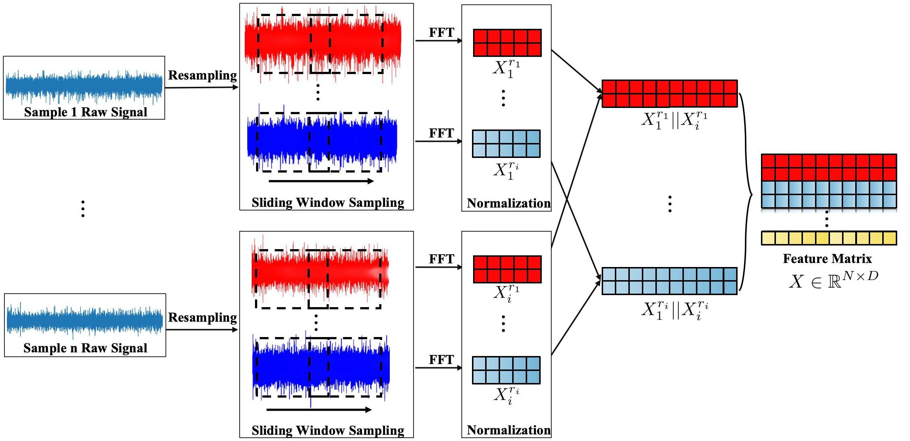

# Rolling-bearing-fault-diagnosis
(Leveraging multiple deep learning models for fault diagnosis)
The purpose of creating this repository is to improve my programming skills, while also providing a new perspective for those interested in this field. I will continue to update this repository regularly.

The workflow of the entire repository is divided into the following steps:
# Environment Settings
* python == 3.9
* torch == 2.0.1
* numpy ==  1.23.5
* matplotlib == 3.7.2

## 1.Data Processing
The data used in this repository is the bearing fault diagnosis dataset from **Jiangnan University**. We first generate our training samples using techniques such as resampling, sliding window sampling, and FFT (Fast Fourier Transform). Please describe the specific processing procedure in conjunction with the following image.


For the specific data processing procedure, please refer to `data.py`.

## 2.Model
I have currently only updated the CNN network architecture (refer to `CNN.py`). I will be updating the subsequent architectures regularly, so please stay tuned to this repository.

## 3.train
You can execute the following command to perform the training, testing, and validation of the network:
````
python train.py
````
## 4.Visualization

