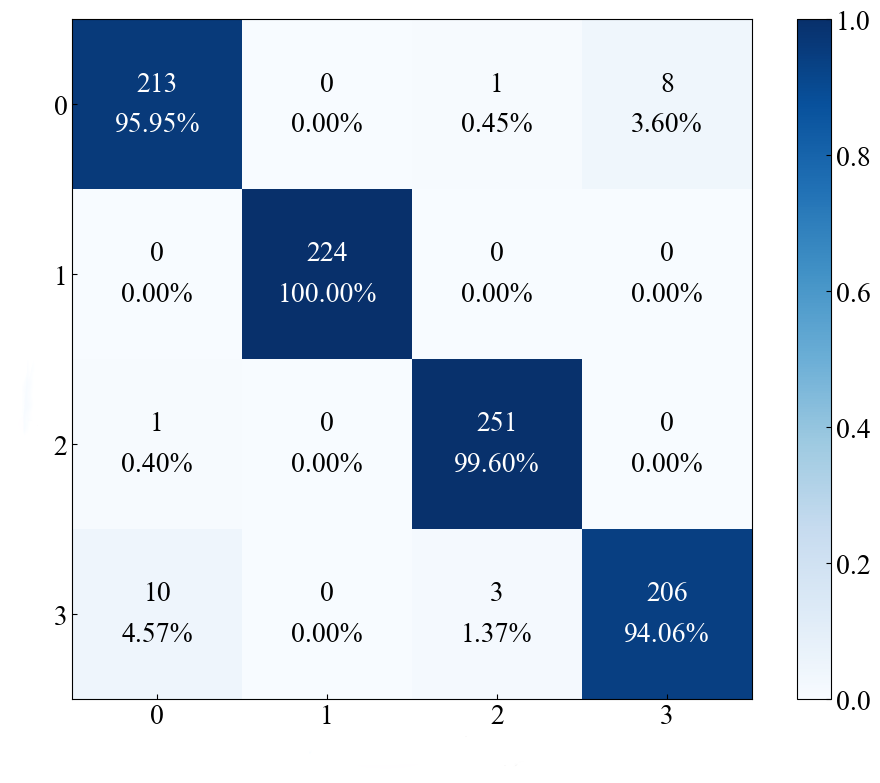

# Rolling-bearing-fault-diagnosis
(Leveraging multiple deep learning models for fault diagnosis)
The purpose of creating this repository is to improve my programming skills, while also providing a new perspective for those interested in this field. I will continue to update this repository regularly.

The workflow of the entire repository is divided into the following steps:
# Environment Settings
* python == 3.9
* torch == 2.0.1
* numpy ==  1.23.5
* matplotlib == 3.7.2

## 1.Data Processing
The data used in this repository is the bearing fault diagnosis dataset from **Jiangnan University**. We first generate our training samples using techniques such as resampling, sliding window sampling, and FFT (Fast Fourier Transform). Please describe the specific processing procedure in conjunction with the following image.


For the specific data processing procedure, please refer to `data.py`.

The following code needs to be run to generate the dataset：

````
python data.py
````

## 2.Model
I have currently only updated the CNN network architecture(refer to `CNN.py`). I will be updating the subsequent architectures regularly, so please stay tuned to this repository. I will update the repository with **Graph Neural Networks (GCN), Hypergraph Neural Networks (HGCN)**, and how to integrate **KAN** in the future. Stay tuned for those updates.
* Application of Attention in CNN: [CNN_attention](./md/CNN_attention.md)
* Transformer Applications in Fault Diagnosis: [Transformer](./md/Transformer.md)
* GCN Applications in Fault Diagnosis: [GCN](./md/GCN.md)
* HyperGraph Applications in Fault Diagnosis: [HyperGraph](./md/HyperGraph.md)
* Diffusion Model Applications in Fault Diagnosis: [Diffusion](./md/Diffusion.md)
* Application of KAN in model: [KAN](./md/KAN.md)


## 3.train
You can execute the following command to perform the training, testing, and validation of the network:
````
python train.py
````
## 4.Visualization
Please refer to the visualization shown in the following image. Stay tuned for updates to the repository.


## 5.Result(CNN)
````
epoch: 0, train_loss: 0.7124, train_acc: 0.7076, val_loss: 2.8137, val_acc: 0.2533
epoch: 1, train_loss: 0.9230, train_acc: 0.6145, val_loss: 1.7241, val_acc: 0.5033
epoch: 2, train_loss: 0.7473, train_acc: 0.6891, val_loss: 1.2297, val_acc: 0.6426
epoch: 3, train_loss: 0.6114, train_acc: 0.7500, val_loss: 0.9684, val_acc: 0.7165
epoch: 4, train_loss: 0.5050, train_acc: 0.7959, val_loss: 0.8085, val_acc: 0.7612
epoch: 5, train_loss: 0.4312, train_acc: 0.8267, val_loss: 0.6792, val_acc: 0.7999
epoch: 6, train_loss: 0.3760, train_acc: 0.8496, val_loss: 0.5938, val_acc: 0.8248
epoch: 7, train_loss: 0.3364, train_acc: 0.8656, val_loss: 0.5233, val_acc: 0.8454
epoch: 8, train_loss: 0.3008, train_acc: 0.8799, val_loss: 0.4658, val_acc: 0.8625
epoch: 9, train_loss: 0.2711, train_acc: 0.8919, val_loss: 0.4197, val_acc: 0.8763
epoch: 10, train_loss: 0.2466, train_acc: 0.9017, val_loss: 0.3822, val_acc: 0.8873
epoch: 11, train_loss: 0.2262, train_acc: 0.9098, val_loss: 0.3516, val_acc: 0.8961
epoch: 12, train_loss: 0.2088, train_acc: 0.9168, val_loss: 0.3249, val_acc: 0.9041
epoch: 13, train_loss: 0.1940, train_acc: 0.9227, val_loss: 0.3019, val_acc: 0.9110
epoch: 14, train_loss: 0.1811, train_acc: 0.9279, val_loss: 0.2820, val_acc: 0.9169
epoch: 15, train_loss: 0.1698, train_acc: 0.9324, val_loss: 0.2646, val_acc: 0.9221
epoch: 16, train_loss: 0.1598, train_acc: 0.9364, val_loss: 0.2492, val_acc: 0.9267
epoch: 17, train_loss: 0.1509, train_acc: 0.9399, val_loss: 0.2355, val_acc: 0.9307
epoch: 18, train_loss: 0.1430, train_acc: 0.9431, val_loss: 0.2233, val_acc: 0.9344
epoch: 19, train_loss: 0.1358, train_acc: 0.9459, val_loss: 0.2122, val_acc: 0.9377
epoch: 20, train_loss: 0.1294, train_acc: 0.9485, val_loss: 0.2023, val_acc: 0.9406
epoch: 21, train_loss: 0.1235, train_acc: 0.9508, val_loss: 0.1932, val_acc: 0.9433
epoch: 22, train_loss: 0.1181, train_acc: 0.9530, val_loss: 0.1849, val_acc: 0.9458
epoch: 23, train_loss: 0.1132, train_acc: 0.9549, val_loss: 0.1773, val_acc: 0.9481
epoch: 24, train_loss: 0.1087, train_acc: 0.9567, val_loss: 0.1703, val_acc: 0.9501
epoch: 25, train_loss: 0.1045, train_acc: 0.9584, val_loss: 0.1638, val_acc: 0.9521
epoch: 26, train_loss: 0.1006, train_acc: 0.9599, val_loss: 0.1579, val_acc: 0.9538
epoch: 27, train_loss: 0.0971, train_acc: 0.9614, val_loss: 0.1523, val_acc: 0.9555
epoch: 28, train_loss: 0.0937, train_acc: 0.9627, val_loss: 0.1471, val_acc: 0.9570
epoch: 29, train_loss: 0.0906, train_acc: 0.9639, val_loss: 0.1423, val_acc: 0.9584
epoch: 30, train_loss: 0.0877, train_acc: 0.9651, val_loss: 0.1378, val_acc: 0.9598
epoch: 31, train_loss: 0.0849, train_acc: 0.9662, val_loss: 0.1335, val_acc: 0.9610
epoch: 32, train_loss: 0.0824, train_acc: 0.9672, val_loss: 0.1295, val_acc: 0.9622
epoch: 33, train_loss: 0.0799, train_acc: 0.9682, val_loss: 0.1258, val_acc: 0.9633
epoch: 34, train_loss: 0.0776, train_acc: 0.9691, val_loss: 0.1223, val_acc: 0.9644
epoch: 35, train_loss: 0.0755, train_acc: 0.9699, val_loss: 0.1189, val_acc: 0.9654
epoch: 36, train_loss: 0.0735, train_acc: 0.9708, val_loss: 0.1157, val_acc: 0.9663
epoch: 37, train_loss: 0.0715, train_acc: 0.9715, val_loss: 0.1128, val_acc: 0.9672
epoch: 38, train_loss: 0.0697, train_acc: 0.9723, val_loss: 0.1099, val_acc: 0.9680
epoch: 39, train_loss: 0.0679, train_acc: 0.9730, val_loss: 0.1072, val_acc: 0.9688
epoch: 40, train_loss: 0.0663, train_acc: 0.9736, val_loss: 0.1046, val_acc: 0.9696
epoch: 41, train_loss: 0.0647, train_acc: 0.9742, val_loss: 0.1022, val_acc: 0.9703
epoch: 42, train_loss: 0.0632, train_acc: 0.9748, val_loss: 0.0999, val_acc: 0.9710
epoch: 43, train_loss: 0.0618, train_acc: 0.9754, val_loss: 0.0976, val_acc: 0.9717
epoch: 44, train_loss: 0.0604, train_acc: 0.9760, val_loss: 0.0955, val_acc: 0.9723
epoch: 45, train_loss: 0.0591, train_acc: 0.9765, val_loss: 0.0935, val_acc: 0.9729
epoch: 46, train_loss: 0.0578, train_acc: 0.9770, val_loss: 0.0915, val_acc: 0.9735
epoch: 47, train_loss: 0.0566, train_acc: 0.9775, val_loss: 0.0896, val_acc: 0.9740
epoch: 48, train_loss: 0.0555, train_acc: 0.9779, val_loss: 0.0878, val_acc: 0.9746
epoch: 49, train_loss: 0.0544, train_acc: 0.9784, val_loss: 0.0861, val_acc: 0.9751
epoch: 50, train_loss: 0.0533, train_acc: 0.9788, val_loss: 0.0845, val_acc: 0.9756
epoch: 51, train_loss: 0.0523, train_acc: 0.9792, val_loss: 0.0829, val_acc: 0.9760
epoch: 52, train_loss: 0.0513, train_acc: 0.9796, val_loss: 0.0813, val_acc: 0.9765
epoch: 53, train_loss: 0.0503, train_acc: 0.9800, val_loss: 0.0799, val_acc: 0.9769
epoch: 54, train_loss: 0.0494, train_acc: 0.9803, val_loss: 0.0784, val_acc: 0.9773
epoch: 55, train_loss: 0.0485, train_acc: 0.9807, val_loss: 0.0771, val_acc: 0.9777
epoch: 56, train_loss: 0.0477, train_acc: 0.9810, val_loss: 0.0757, val_acc: 0.9781
epoch: 57, train_loss: 0.0469, train_acc: 0.9813, val_loss: 0.0745, val_acc: 0.9785
epoch: 58, train_loss: 0.0461, train_acc: 0.9817, val_loss: 0.0732, val_acc: 0.9789
epoch: 59, train_loss: 0.0453, train_acc: 0.9820, val_loss: 0.0720, val_acc: 0.9792
epoch: 60, train_loss: 0.0446, train_acc: 0.9823, val_loss: 0.0709, val_acc: 0.9796
epoch: 61, train_loss: 0.0438, train_acc: 0.9825, val_loss: 0.0698, val_acc: 0.9799
epoch: 62, train_loss: 0.0431, train_acc: 0.9828, val_loss: 0.0687, val_acc: 0.9802
epoch: 63, train_loss: 0.0425, train_acc: 0.9831, val_loss: 0.0676, val_acc: 0.9805
epoch: 64, train_loss: 0.0418, train_acc: 0.9834, val_loss: 0.0666, val_acc: 0.9808
epoch: 65, train_loss: 0.0412, train_acc: 0.9836, val_loss: 0.0656, val_acc: 0.9811
epoch: 66, train_loss: 0.0406, train_acc: 0.9839, val_loss: 0.0647, val_acc: 0.9814
epoch: 67, train_loss: 0.0400, train_acc: 0.9841, val_loss: 0.0637, val_acc: 0.9817
epoch: 68, train_loss: 0.0394, train_acc: 0.9843, val_loss: 0.0628, val_acc: 0.9819
epoch: 69, train_loss: 0.0388, train_acc: 0.9845, val_loss: 0.0620, val_acc: 0.9822
epoch: 70, train_loss: 0.0383, train_acc: 0.9848, val_loss: 0.0611, val_acc: 0.9824
epoch: 71, train_loss: 0.0378, train_acc: 0.9850, val_loss: 0.0603, val_acc: 0.9827
epoch: 72, train_loss: 0.0372, train_acc: 0.9852, val_loss: 0.0595, val_acc: 0.9829
epoch: 73, train_loss: 0.0367, train_acc: 0.9854, val_loss: 0.0587, val_acc: 0.9832
epoch: 74, train_loss: 0.0362, train_acc: 0.9856, val_loss: 0.0579, val_acc: 0.9834
epoch: 75, train_loss: 0.0358, train_acc: 0.9858, val_loss: 0.0572, val_acc: 0.9836
epoch: 76, train_loss: 0.0353, train_acc: 0.9859, val_loss: 0.0565, val_acc: 0.9838
epoch: 77, train_loss: 0.0349, train_acc: 0.9861, val_loss: 0.0558, val_acc: 0.9840
epoch: 78, train_loss: 0.0344, train_acc: 0.9863, val_loss: 0.0551, val_acc: 0.9842
epoch: 79, train_loss: 0.0340, train_acc: 0.9865, val_loss: 0.0544, val_acc: 0.9844
epoch: 80, train_loss: 0.0336, train_acc: 0.9866, val_loss: 0.0538, val_acc: 0.9846
epoch: 81, train_loss: 0.0332, train_acc: 0.9868, val_loss: 0.0531, val_acc: 0.9848
epoch: 82, train_loss: 0.0328, train_acc: 0.9870, val_loss: 0.0525, val_acc: 0.9850
epoch: 83, train_loss: 0.0324, train_acc: 0.9871, val_loss: 0.0519, val_acc: 0.9852
epoch: 84, train_loss: 0.0320, train_acc: 0.9873, val_loss: 0.0513, val_acc: 0.9853
epoch: 85, train_loss: 0.0316, train_acc: 0.9874, val_loss: 0.0507, val_acc: 0.9855
epoch: 86, train_loss: 0.0312, train_acc: 0.9876, val_loss: 0.0501, val_acc: 0.9857
epoch: 87, train_loss: 0.0309, train_acc: 0.9877, val_loss: 0.0496, val_acc: 0.9858
epoch: 88, train_loss: 0.0305, train_acc: 0.9878, val_loss: 0.0491, val_acc: 0.9860
epoch: 89, train_loss: 0.0302, train_acc: 0.9880, val_loss: 0.0485, val_acc: 0.9861
epoch: 90, train_loss: 0.0299, train_acc: 0.9881, val_loss: 0.0480, val_acc: 0.9863
epoch: 91, train_loss: 0.0295, train_acc: 0.9882, val_loss: 0.0475, val_acc: 0.9864
epoch: 92, train_loss: 0.0292, train_acc: 0.9884, val_loss: 0.0470, val_acc: 0.9866
epoch: 93, train_loss: 0.0289, train_acc: 0.9885, val_loss: 0.0465, val_acc: 0.9867
epoch: 94, train_loss: 0.0286, train_acc: 0.9886, val_loss: 0.0460, val_acc: 0.9869
epoch: 95, train_loss: 0.0283, train_acc: 0.9887, val_loss: 0.0456, val_acc: 0.9870
epoch: 96, train_loss: 0.0280, train_acc: 0.9888, val_loss: 0.0451, val_acc: 0.9871
epoch: 97, train_loss: 0.0277, train_acc: 0.9890, val_loss: 0.0447, val_acc: 0.9873
epoch: 98, train_loss: 0.0275, train_acc: 0.9891, val_loss: 0.0443, val_acc: 0.9874
epoch: 99, train_loss: 0.0272, train_acc: 0.9892, val_loss: 0.0438, val_acc: 0.9875
epoch: 100, train_loss: 0.0269, train_acc: 0.9893, val_loss: 0.0434, val_acc: 0.9877
epoch: 101, train_loss: 0.0267, train_acc: 0.9894, val_loss: 0.0430, val_acc: 0.9878
epoch: 102, train_loss: 0.0264, train_acc: 0.9895, val_loss: 0.0426, val_acc: 0.9879
epoch: 103, train_loss: 0.0261, train_acc: 0.9896, val_loss: 0.0422, val_acc: 0.9880
epoch: 104, train_loss: 0.0259, train_acc: 0.9897, val_loss: 0.0418, val_acc: 0.9881
epoch: 105, train_loss: 0.0256, train_acc: 0.9898, val_loss: 0.0414, val_acc: 0.9882
epoch: 106, train_loss: 0.0254, train_acc: 0.9899, val_loss: 0.0411, val_acc: 0.9883
epoch: 107, train_loss: 0.0252, train_acc: 0.9900, val_loss: 0.0407, val_acc: 0.9885
epoch: 108, train_loss: 0.0249, train_acc: 0.9901, val_loss: 0.0403, val_acc: 0.9886
epoch: 109, train_loss: 0.0247, train_acc: 0.9902, val_loss: 0.0400, val_acc: 0.9887
epoch: 110, train_loss: 0.0245, train_acc: 0.9903, val_loss: 0.0397, val_acc: 0.9888
epoch: 111, train_loss: 0.0243, train_acc: 0.9903, val_loss: 0.0393, val_acc: 0.9889
epoch: 112, train_loss: 0.0241, train_acc: 0.9904, val_loss: 0.0390, val_acc: 0.9890
epoch: 113, train_loss: 0.0238, train_acc: 0.9905, val_loss: 0.0387, val_acc: 0.9891
epoch: 114, train_loss: 0.0236, train_acc: 0.9906, val_loss: 0.0383, val_acc: 0.9891
epoch: 115, train_loss: 0.0234, train_acc: 0.9907, val_loss: 0.0380, val_acc: 0.9892
epoch: 116, train_loss: 0.0232, train_acc: 0.9908, val_loss: 0.0377, val_acc: 0.9893
epoch: 117, train_loss: 0.0230, train_acc: 0.9908, val_loss: 0.0374, val_acc: 0.9894
epoch: 118, train_loss: 0.0228, train_acc: 0.9909, val_loss: 0.0371, val_acc: 0.9895
epoch: 119, train_loss: 0.0227, train_acc: 0.9910, val_loss: 0.0368, val_acc: 0.9896
epoch: 120, train_loss: 0.0225, train_acc: 0.9911, val_loss: 0.0365, val_acc: 0.9897
epoch: 121, train_loss: 0.0223, train_acc: 0.9911, val_loss: 0.0362, val_acc: 0.9898
epoch: 122, train_loss: 0.0221, train_acc: 0.9912, val_loss: 0.0360, val_acc: 0.9899
epoch: 123, train_loss: 0.0219, train_acc: 0.9913, val_loss: 0.0357, val_acc: 0.9899
epoch: 124, train_loss: 0.0218, train_acc: 0.9913, val_loss: 0.0354, val_acc: 0.9900
epoch: 125, train_loss: 0.0216, train_acc: 0.9914, val_loss: 0.0352, val_acc: 0.9901
epoch: 126, train_loss: 0.0214, train_acc: 0.9915, val_loss: 0.0349, val_acc: 0.9902
epoch: 127, train_loss: 0.0212, train_acc: 0.9915, val_loss: 0.0346, val_acc: 0.9903
epoch: 128, train_loss: 0.0211, train_acc: 0.9916, val_loss: 0.0344, val_acc: 0.9903
epoch: 129, train_loss: 0.0209, train_acc: 0.9917, val_loss: 0.0341, val_acc: 0.9904
epoch: 130, train_loss: 0.0208, train_acc: 0.9917, val_loss: 0.0339, val_acc: 0.9905
epoch: 131, train_loss: 0.0206, train_acc: 0.9918, val_loss: 0.0337, val_acc: 0.9905
epoch: 132, train_loss: 0.0204, train_acc: 0.9919, val_loss: 0.0334, val_acc: 0.9906
epoch: 133, train_loss: 0.0203, train_acc: 0.9919, val_loss: 0.0332, val_acc: 0.9907
epoch: 134, train_loss: 0.0201, train_acc: 0.9920, val_loss: 0.0330, val_acc: 0.9908
epoch: 135, train_loss: 0.0200, train_acc: 0.9920, val_loss: 0.0327, val_acc: 0.9908
epoch: 136, train_loss: 0.0198, train_acc: 0.9921, val_loss: 0.0325, val_acc: 0.9909
epoch: 137, train_loss: 0.0197, train_acc: 0.9922, val_loss: 0.0323, val_acc: 0.9910
epoch: 138, train_loss: 0.0196, train_acc: 0.9922, val_loss: 0.0321, val_acc: 0.9910
epoch: 139, train_loss: 0.0194, train_acc: 0.9923, val_loss: 0.0319, val_acc: 0.9911
epoch: 140, train_loss: 0.0193, train_acc: 0.9923, val_loss: 0.0316, val_acc: 0.9911
epoch: 141, train_loss: 0.0191, train_acc: 0.9924, val_loss: 0.0314, val_acc: 0.9912
epoch: 142, train_loss: 0.0190, train_acc: 0.9924, val_loss: 0.0312, val_acc: 0.9913
epoch: 143, train_loss: 0.0189, train_acc: 0.9925, val_loss: 0.0310, val_acc: 0.9913
epoch: 144, train_loss: 0.0188, train_acc: 0.9925, val_loss: 0.0308, val_acc: 0.9914
epoch: 145, train_loss: 0.0186, train_acc: 0.9926, val_loss: 0.0307, val_acc: 0.9914
epoch: 146, train_loss: 0.0185, train_acc: 0.9926, val_loss: 0.0305, val_acc: 0.9915
epoch: 147, train_loss: 0.0184, train_acc: 0.9927, val_loss: 0.0303, val_acc: 0.9915
epoch: 148, train_loss: 0.0182, train_acc: 0.9927, val_loss: 0.0301, val_acc: 0.9916
epoch: 149, train_loss: 0.0181, train_acc: 0.9928, val_loss: 0.0299, val_acc: 0.9916
epoch: 150, train_loss: 0.0180, train_acc: 0.9928, val_loss: 0.0297, val_acc: 0.9917
epoch: 151, train_loss: 0.0179, train_acc: 0.9929, val_loss: 0.0296, val_acc: 0.9917
epoch: 152, train_loss: 0.0178, train_acc: 0.9929, val_loss: 0.0294, val_acc: 0.9918
epoch: 153, train_loss: 0.0177, train_acc: 0.9930, val_loss: 0.0292, val_acc: 0.9918
epoch: 154, train_loss: 0.0175, train_acc: 0.9930, val_loss: 0.0291, val_acc: 0.9919
epoch: 155, train_loss: 0.0174, train_acc: 0.9931, val_loss: 0.0289, val_acc: 0.9919
epoch: 156, train_loss: 0.0173, train_acc: 0.9931, val_loss: 0.0287, val_acc: 0.9919
epoch: 157, train_loss: 0.0172, train_acc: 0.9932, val_loss: 0.0286, val_acc: 0.9920
epoch: 158, train_loss: 0.0171, train_acc: 0.9932, val_loss: 0.0284, val_acc: 0.9920
epoch: 159, train_loss: 0.0170, train_acc: 0.9932, val_loss: 0.0283, val_acc: 0.9921
epoch: 160, train_loss: 0.0169, train_acc: 0.9933, val_loss: 0.0281, val_acc: 0.9921
epoch: 161, train_loss: 0.0168, train_acc: 0.9933, val_loss: 0.0280, val_acc: 0.9922
epoch: 162, train_loss: 0.0167, train_acc: 0.9934, val_loss: 0.0278, val_acc: 0.9922
epoch: 163, train_loss: 0.0166, train_acc: 0.9934, val_loss: 0.0277, val_acc: 0.9922
epoch: 164, train_loss: 0.0165, train_acc: 0.9934, val_loss: 0.0275, val_acc: 0.9923
epoch: 165, train_loss: 0.0164, train_acc: 0.9935, val_loss: 0.0274, val_acc: 0.9923
epoch: 166, train_loss: 0.0163, train_acc: 0.9935, val_loss: 0.0272, val_acc: 0.9923
epoch: 167, train_loss: 0.0162, train_acc: 0.9936, val_loss: 0.0271, val_acc: 0.9924
epoch: 168, train_loss: 0.0161, train_acc: 0.9936, val_loss: 0.0270, val_acc: 0.9924
epoch: 169, train_loss: 0.0160, train_acc: 0.9936, val_loss: 0.0269, val_acc: 0.9924
epoch: 170, train_loss: 0.0159, train_acc: 0.9937, val_loss: 0.0267, val_acc: 0.9925
epoch: 171, train_loss: 0.0158, train_acc: 0.9937, val_loss: 0.0266, val_acc: 0.9925
epoch: 172, train_loss: 0.0157, train_acc: 0.9937, val_loss: 0.0265, val_acc: 0.9925
epoch: 173, train_loss: 0.0156, train_acc: 0.9938, val_loss: 0.0264, val_acc: 0.9925
epoch: 174, train_loss: 0.0155, train_acc: 0.9938, val_loss: 0.0263, val_acc: 0.9925
epoch: 175, train_loss: 0.0231, train_acc: 0.9913, val_loss: 0.0340, val_acc: 0.9883
epoch: 176, train_loss: 0.0308, train_acc: 0.9871, val_loss: 0.0417, val_acc: 0.9841
epoch: 177, train_loss: 0.0384, train_acc: 0.9829, val_loss: 0.0492, val_acc: 0.9799
epoch: 178, train_loss: 0.0460, train_acc: 0.9788, val_loss: 0.0567, val_acc: 0.9758
epoch: 179, train_loss: 0.0534, train_acc: 0.9747, val_loss: 0.0641, val_acc: 0.9718
epoch: 180, train_loss: 0.0608, train_acc: 0.9706, val_loss: 0.0714, val_acc: 0.9678
epoch: 181, train_loss: 0.0681, train_acc: 0.9665, val_loss: 0.0786, val_acc: 0.9639
epoch: 182, train_loss: 0.0753, train_acc: 0.9625, val_loss: 0.0858, val_acc: 0.9600
epoch: 183, train_loss: 0.0824, train_acc: 0.9585, val_loss: 0.0928, val_acc: 0.9561
epoch: 184, train_loss: 0.0894, train_acc: 0.9546, val_loss: 0.0998, val_acc: 0.9523
epoch: 185, train_loss: 0.0964, train_acc: 0.9507, val_loss: 0.1067, val_acc: 0.9485
epoch: 186, train_loss: 0.1033, train_acc: 0.9469, val_loss: 0.1136, val_acc: 0.9448
epoch: 187, train_loss: 0.1101, train_acc: 0.9432, val_loss: 0.1204, val_acc: 0.9411
epoch: 188, train_loss: 0.1169, train_acc: 0.9395, val_loss: 0.1271, val_acc: 0.9374
epoch: 189, train_loss: 0.1236, train_acc: 0.9358, val_loss: 0.1337, val_acc: 0.9338
epoch: 190, train_loss: 0.1302, train_acc: 0.9322, val_loss: 0.1402, val_acc: 0.9302
epoch: 191, train_loss: 0.1367, train_acc: 0.9286, val_loss: 0.1467, val_acc: 0.9267
epoch: 192, train_loss: 0.1432, train_acc: 0.9250, val_loss: 0.1532, val_acc: 0.9232
epoch: 193, train_loss: 0.1496, train_acc: 0.9215, val_loss: 0.1595, val_acc: 0.9197
epoch: 194, train_loss: 0.1560, train_acc: 0.9180, val_loss: 0.1658, val_acc: 0.9163
epoch: 195, train_loss: 0.1622, train_acc: 0.9146, val_loss: 0.1720, val_acc: 0.9129
epoch: 196, train_loss: 0.1685, train_acc: 0.9111, val_loss: 0.1782, val_acc: 0.9095
epoch: 197, train_loss: 0.1746, train_acc: 0.9078, val_loss: 0.1843, val_acc: 0.9062
epoch: 198, train_loss: 0.1807, train_acc: 0.9044, val_loss: 0.1903, val_acc: 0.9029
epoch: 199, train_loss: 0.1867, train_acc: 0.9011, val_loss: 0.1963, val_acc: 0.8996
avg acc: 0.99, avg f1 score: 0.99
````
## 6.Colab Example
* CNN https://colab.research.google.com/drive/11oUiFY0ECD6CAL2CqO_VbhnSrCj80_Vw#scrollTo=tF5Ky0wz10u8
