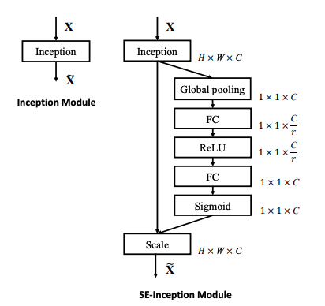
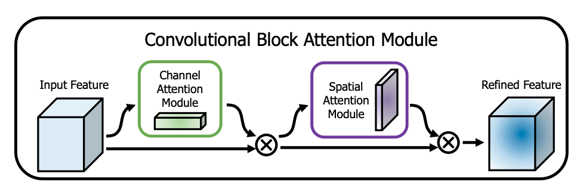

# Application of Attention in CNN

## 1. SE_Conv 
Incorporating the concept of the **SE network** ([paper](https://arxiv.org/pdf/1709.01507)), the **SE_Conv network** architecture has been created. The model architecture of SE network is shown in the figure below:

## 2. CBAM_Conv
Incorporating the concept of the **CBAM** ([paper](https://arxiv.org/pdf/1807.06521)), the **CBAM_Conv network** architecture has been created. The model architecture of CBAM network is shown in the figure below:

