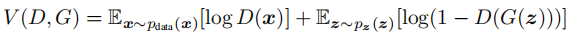
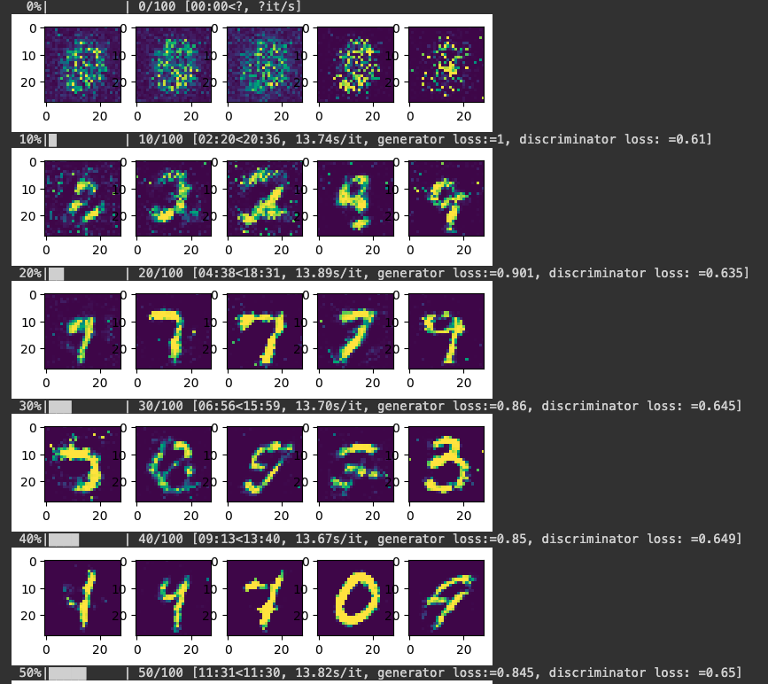
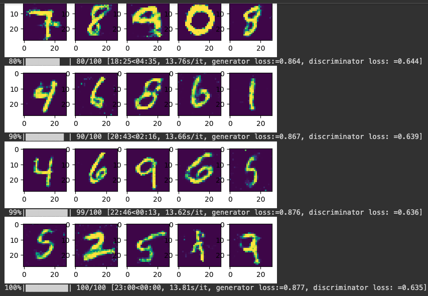

# Generative Adversarial Nets ([GAN](https://arxiv.org/abs/1406.2661))

## Generator and Discruminator
* $G(x;\theta_g)$, where **G** is a diffrerntiable function represent by MLP with parameters $\theta_g$;

* $D(x;\theta_d)$ that outputs a **single scalar**

## Value function $V(G, D)$

* **Discussion based on a classification task:**
  
If we consider real images as 1 and generated images as 0, we can clearly understand the following: if $D$ is trained particularly well and $D(G(z))=0$, then $log(1 - D(G(z))) = log1 = 0$. At this point, $D(x) = 1$, so $log(D(x)) = 1$, and the overall $V(G, D)=0$.
* Based on the above analysis, we first train $D$ to ensure $\max _D V(D, G)$. Due to the nature of the logarithm function, when $D$ is not well-trained, $V(G, D)$ will be a negative value.

* Next, we train $G$ to minimize $\min _G V(G, D)$, which means gradually reducing $log(1 - D(z))$. This is to avoid the scenario where $D(G(z)) = 1$. In extreme cases, if $D(G(z)) = 1$, then $log(1 - D(G(z))) = log0 \sim -\infty$. Therefore, by training $G$, we aim to make $D$ unable to distinguish whether the generated images are 0 or 1.
## Demo

